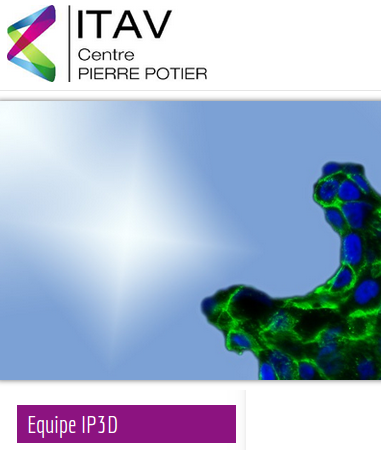

title: Mu spim, a ligth-sheet microscope for smartphones
slug: mu_spim_rubber
date:
tags: mu-spim, microscopy
summary: I'm happy to present the prototype of the mu-spim, a light-sheet microscope.

## Intro

Le Mu-spim est un microscope à **feuille de lumière** pour smartphone.

_Mu-spim implements **light sheet microscopy** on a
smartphone._

À droite de l'image, on voit le téléphone avec le mu-spim au dos. La caméra du
téléphone regarde à travers un objectif dans le petit cube blanc (la chambre).
Pour prendre une image, on suspend l'échantillon (ici un grain de poivre) dans
la chambre, à l'aide de la pince photographiée.

Le microscope utilise la LED du téléphone pour illuminer un échantillon, et
**une lentille cylindrique** crée une feuille de lumière. On voit une section de
ce champ lumineux dans l'image de  gauche.

Il y a encore beaucoup de travail pour avoir un instrument correct, mais c'est
quand même la concrétisation de quelques mois de remue-méninges.

_On the right of the above image, one can see the upright phone, with the mu-spim
strapped on its back. The phone's camera looks through a the objective in the
small white cube, the chamber. To take an image, one suspends the sample (here a
grain of peper) in the chamber, with the help of the tweezers pictured. The
microscope uses the phone's LED flash to illuminate the sample, and a
**cylindrical lens** creates a light-sheet. A section of the flat light field
can be seen on the next image._

_There is still a lot of work to have a proper instrument, but that nevertheless
the concrete output of some months worth of head scratching._

## Un projet ouvert // an open project

Toute la documentation, les plans et les images de ce projet sont distribuées
sous licence Creative Commons (CC BY-SA-NC). Cela veut dire que chacun peut
contribuer au projet ou le dériver, à condition d'en citer [la
source](https://github.com/DamCB/mu-spim), de partager le travail dérivé dans
les mêmes conditions et de ne pas en tirer de bénéfices commerciaux (cette
protection supplémentaire pourra être levée si le financement du projet est
assuré).

_All the documentation, blue prints and images of this project are distributed
under a CC-BY-SA-NC licence. The nono-commercial close is an extra-protection for the beginning of the project, and might be lifted when funding is secured._

## Pourquoi mu-spim - why the name?

Commençons par la fin: SPIM veut dire, en anglais, _Selective Plane Illumination
Microscopy_,  ou microscopie par illumination plane sélective. C'est un des
premiers acronymes utilisé pour ce type de microscope, et il "sonne" bien. Le
préfixe mu veut bien sûr dire micro, mais fait plus particulièrement référence à
un modèle d'appareil photo, le µ-1 d'Olympius, un petit compact à pélicule et
mon premier appareil.

_SPIM stands for Selective Plane illumination Microscopy and was an early acronym
coined for ligth-sheet fluorescence microscopy, plus it's catchy. The "mu"
prefix stands of course for micro, but is also a reference to the Olympius µ-1
camera model, which was my first._  

## Un peu d'histoire // a brief history

La **microscopie à feuille de lumière** est une méthode initialement développée au
début du XXème  siècle, et re-découverte par le groupe de Ernst
Stelzer (à Heidelberg) il y a une dizaine d'année. Avec les techniques modernes,
cette méthode a permis d'obtenir des données exceptionnelles en biologie
cellulaire et du développement: cette méthode d'illumination donne accès à
des images détaillées en 3 dimensions sans trop éclairer l'échantillon. Une
recherche de vidéos ou d'images avec les mots clefs _light sheet microscopy_
devrait vous en convaincre.

En 2008, Corinne Lorenzo et moi avons passé
une semaine dans le labo de Steltzer où Emmanuel Reynaud nous a appris la
méthode. Nous étions tous les deux au LBCMCP à Toulouse, et en rentrant, nous
avons fabriqué le premier SPIM français. On trouvera une discussion détaillée en
français dans [cet article de
medecine/science](http://www.medecinesciences.org/articles/medsci/pdf/2011/07/medsci2011278-9p753.pdf).

_Light sheet microscopy was initially developed in the early XXth
century and rediscovered by Ernst Steltzer group at EMBL (Heidelberg) about ten
years ago. Refitted with modern instrumentation and detectors, it gave birth to
a wealth of exceptional data in cell and develoment biology giving access to long terms 3D images. Go look it up, there are plenty of videos around._

_In 2008, Corinne Lorenzo and I spent one week in Steltzer's lab, and Emmanuel
Reynaud taught us the bases of light sheet microscopy. Comming back to the LBCMCP wher we both worked at the time, we build the first French light-sheet microscope._

J'ai eu l'idée du mu-spim il y a environ un an, parce que je cherchais un projet
expérimental, me permettant de sortir un peu la tête de mon ordinateur, du
langage de programmation python et du [calcul scientifique](http://damcb.com).
La source d'inspiration majeure a été le [**foldscope**
[en]](http://www.foldscope.com/), un microscope en papier coûtant moins de 1
dollar, créé par l'équipe de Manu Prakash à Stanford. Ce projet est une
référence à tous les niveaux (sur les aspects éducatifs, l'optique,
l'ergonomie).

> Le mu-spim est un croisement de ces deux instruments, pour voir ce qui peut
résulter de la poliniation croisée.

_I got the idea of the mu-spim about a year ago, scratching my head for an
experimental project that would take me out of [scientific
computing](http://damcb.com). The major inspiration source has been the
[**foldscope** [en]](http://www.foldscope.com/), a paper microscope costing less
than 1 dollar, created by Manu Parkash's team at Stanford. This project is an
absolute reference at every level (educational, optics, usability...)._

>_The mu-spim is a mashup of those two microscopes,
to see what can come out of the breeding!_

# Now for some images!

## Une graîne de cumin

## One video, fleur sêchée

<iframe src="https://player.vimeo.com/video/138321561" width="500" height="281" frameborder="0" webkitallowfullscreen mozallowfullscreen allowfullscreen></iframe> 
<a href="https://vimeo.com/138321561">Fleur s&ecirc;ch&eacute;e // Microscopy image of a flower stem. #mu-spim</a> from <a href="https://vimeo.com/user12210065">glyg</a> on <a href="https://vimeo.com">Vimeo</a>.

### À l'aide!!

Ce projet est encore au début de son développement, et a besoin de bras! Je
cherche des collaborateurs avec des compétences dans:

* L'_éducation, la vulgarisation, la divulgation_:

 Le but premier du mu-spim est de permettre la manipulation d'un microscope et
 l'observation de petits objets (vivants) par des jeunes publics et des scientifiques
 amateurs, en lien avec l'univers des fablabs et la recherche en biologie.

* La _communication scientifique_:

  Dans un deuxième temps, le projet mettra  en lien le public et les biologistes /
  microscopistes, à travers l'échange d'échantillons et d'images. C'est
  l'occasion de raconter un peu ce qu'il se passe dans les labos! Il y a en
  général sur le projet un gros boulot de rédactionnel (explication, notices de montage, etc.)

* La _production de projet / financement_:

  Eh oui, on ne vit pas seulement d'amour et d'eau fraîche. Ce projet mérite
  d'être appuyé financièrement, si vous avez l'expérience de ce type de
  production (subventions / financement participatif...), faîtes signe!

* Le _dessin technique, la CAO_:

  Il y a encore beaucoup à faire sur ce plan là,
  améliorer les suppports d'optiques, dessiner le/les supports d'échantillons (motorisés!), faire une version facilement imprimable, etc.

* Le _design_:

  Voir la première photo de ce post, là aussi il y a du boulot!
  Il faut dessiner le carénage, la boîte de transport, penser entièrement
  l'ergonomie de la collecte et du montage d'échantillon ...

* Le _développement mobile_:

  L'appli photo du téléphone n'est pas suffisante pour gérer finement
  l'aquisition d'image, une application dédiée sur le smartphone est
  indispensable!

* Le _traitement d'images et la vidéo_:

 Il y a du montage à faire, de la composition, la vidéo d'une campagne de
 financement participatif, etc. Il y a aussi des aspects web/backend qui peuvent
 être intéressants (site du projet, galerie...)

* L'_analyse d'image et la reconstuction 3D_:

 Le microscope doit permettre à terme d'accéder à une reconstruction 3D de l'objet imagé.
 Il faut développer la chaîne de traitement d'images permettant cette reconstruction.  
 Vaste programme, mais la microscopie à feuille de lumière est une méthode 3D,
 et l'un des objectifs du projet est là!

* La _microbiologie et la microscopie_ (last but not least):

  Je cherche des échantillons, des images, des sujets et des cas d'usage... Si
  vous êtes amenés à regarder des choses à la binoculaire, c'est intéressant
  pour le projet!

## Remerciements, soutiens

> **Ce projet est soutenu matériellement par l'équipe IP3D de l'ITAV.**

> Merci à Corrine Lorenzo, Bernard Ducommun, Martine Cazalès, Valérie Lobjois et
toute l'équipe!

## Open manifesto // Projet libre

Quelques points fondamentaux sur l'éthique libre du projet. Le mu-spim est pensé
comme une plate-forme ouverte de microscopie pour smartphone. La version
courante, baptisée "caoutchouc", est distribué selon une licence Creative Commons, permettant à chacun d'y participer librement.

Libre ne veut pas dire gratuit et tout travail mérite salaire, je suis donc à la
recherche active de financements.

Le projet est hébergé par la société **[DamCB](http://damcb.com)**.

Le projet mu-spim est sous licence CC-BY-SA-NC. guillaume@damcb.com
