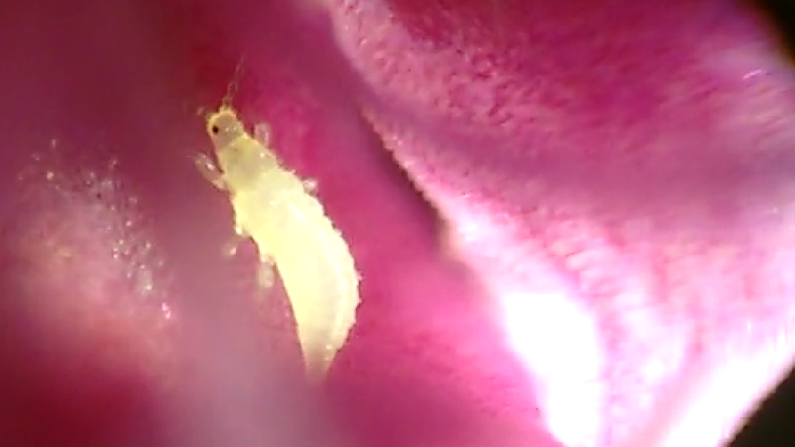
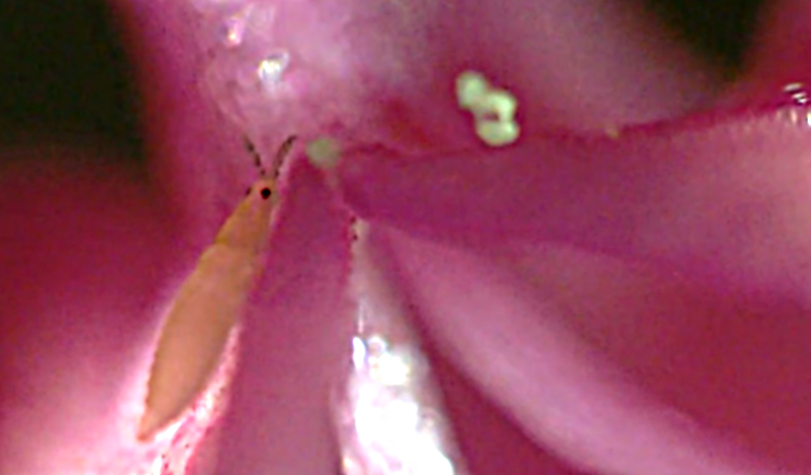
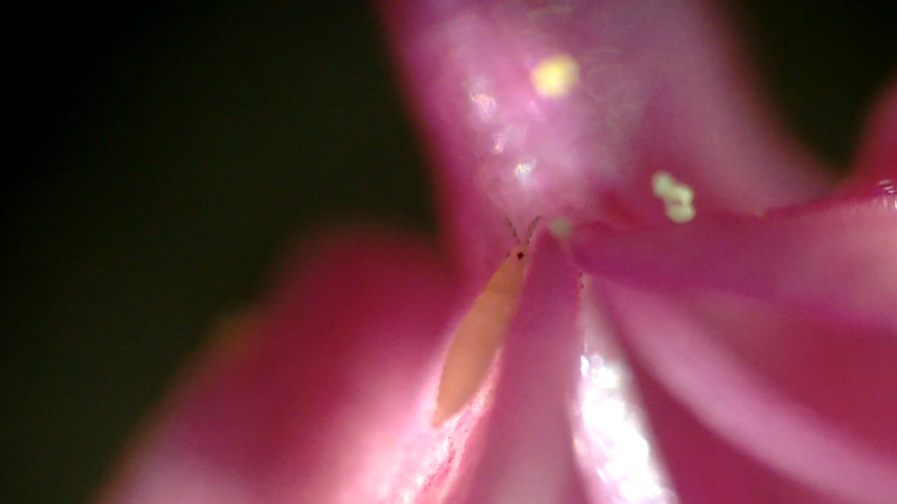

title: What's this colombella?
slug: Kropo
date: 09-08-2015
tags: kropo, microscopy, colombella
gallery:rubber
summary: So what is it?

It is about 0.7 mm in length, was found inside a centranthus rubens flower on a
Mediterranean beach close to Marseille.

See [this video](https://vimeo.com/138897580#t=50s) for more views.
